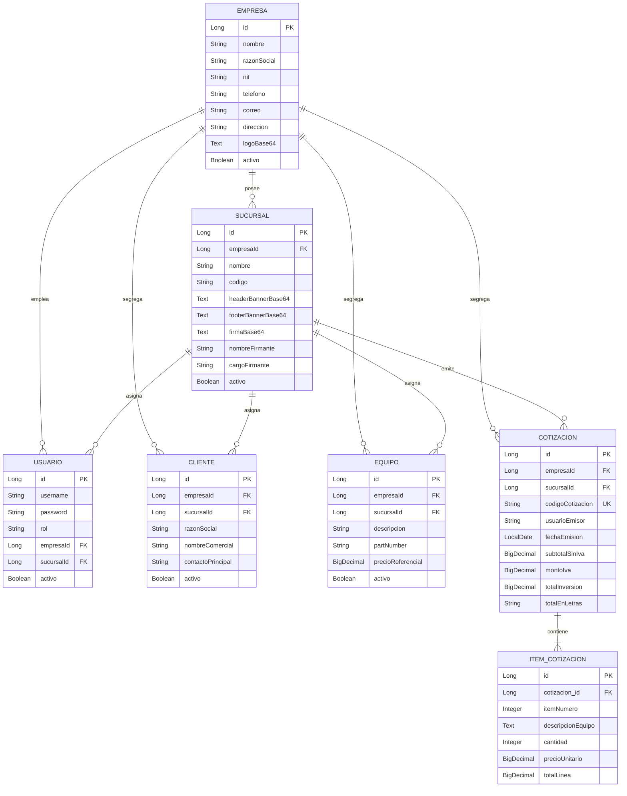

# AGENT GUIDE & ARCHITECTURAL BLUEPRINT (BACKEND)
> **Documento maestro para Agentes IA y Desarrolladores Senior**  
> Repositorio: `WebAppRetail_BackEnd`  
> Este documento contiene el contexto completo del sistema, decisiones de diseño, modelo de datos, seguridad, reglas de negocio y directrices para implementar cambios o nuevos módulos sin pérdida de contexto ni consumo excesivo de tokens.

---

## 1. Visión General del Dominio
El backend de **WebAppRetail** es una API REST empresarial desarrollada para el sector Retail / Equipamiento Comercial en **El Salvador**. Proporciona el soporte transaccional para:
1. **Cotizaciones Comerciales**: Creación, correlativos automáticos, cálculo legal de impuestos (13% IVA), conversión legal de montos a letras y generación de PDF de alta fidelidad.
2. **Multi-Sucursal / Multi-Empresa**: Soporte multi-tenant lógico donde cada sucursal tiene sus propios clientes, equipos, vendedores y membretes gráficos (cintillos y firmas).
3. **Catálogos y Carga Masiva**: CRUD completo e importación transaccional por lotes (CSV/Excel) de Clientes y Equipos.
4. **Control de Acceso Basado en Roles (RBAC)**: Autenticación JWT stateless con 3 niveles de privilegios: `ADMIN`, `GERENTE` y `VENTAS`.

---

## 2. Pila Tecnológica y Dependencias Críticas

| Tecnología | Versión | Propósito / Justificación |
| :--- | :--- | :--- |
| **Java** | 17 (LTS) | Runtime principal (Eclipse Temurin / OpenJDK). |
| **Spring Boot** | 3.3.4 | Framework base con `starter-web`, `starter-data-jpa`, `starter-security`, `starter-validation`, `starter-thymeleaf`. |
| **Spring Security** | 6.x | Seguridad perimetral y filtros de autorización sin estado (Stateless). |
| **JJWT** | 0.12.6 | Generación y validación de tokens JWT (`jjwt-api`, `jjwt-impl`, `jjwt-jackson`). |
| **MySQL Connector** | 8.3+ | Driver JDBC para MySQL 8 (local o Aiven Cloud con SSL forzado). |
| **OpenHTMLtoPDF** | 1.0.10 | Renderizado HTML/CSS a PDF en modo rápido (`PdfRendererBuilder`). |
| **Apache PDFBox** | 2.0.31 | Manipulación binaria y estampado multi-página de cintillos y firmas sobre el PDF base. |
| **Lombok** | 1.18+ | Reducción de boilerplate en entidades y DTOs (`@Getter`, `@Setter`, `@Builder`). |

---

## 3. Topología de Paquetes (Arquitectura: Monolito Modular)

El proyecto sigue una estructura **Package-by-Feature** (empaquetado por dominio de negocio), desacoplada y lista para evolucionar hacia nuevos módulos (ej. Facturación, Inventario):

```text
src/main/java/com/retail/cotizador/
├── CotizadorApplication.java          # Punto de entrada de Spring Boot
│
├── common/                            # Componentes transversales
│   ├── config/
│   │   ├── CorsConfig.java            # Configuración CORS con orígenes dinámicos
│   │   └── DataInitializer.java       # Siembra y verificación inicial (usuarios y sucursales)
│   ├── exception/
│   │   ├── GlobalExceptionHandler.java# @RestControllerAdvice (400, 401, 403, 404, 500)
│   │   └── ResourceNotFoundException.java
│   └── util/
│       └── NumeroALetrasUtil.java     # Algoritmo de conversión a letras (Dólares salvadoreños)
│
├── auth/                              # Módulo 1: Seguridad y Autenticación
│   ├── controller/AuthController.java # Endpoints /login, /me, /health (UptimeRobot)
│   ├── dto/                           # LoginRequestDto, AuthResponseDto (incluye empresaId, empresaNombre)
│   ├── filter/JwtAuthenticationFilter.java # Filtro perimetral OncePerRequestFilter
│   ├── security/
│   │   ├── SecurityConfig.java        # Reglas de autorización HTTP, PasswordEncoder, CORS Source
│   │   └── UserPrincipal.java         # Implementación de UserDetails con empresaId y sucursalId
│   └── service/
│       ├── CustomUserDetailsService.java
│       └── JwtService.java            # Generación y parseo de claims (id, rol, sucursalId, empresaId)
│
├── empresas/                          # Módulo 2: Multi-Empresas (SaaS Multi-Tenant)
│   ├── controller/EmpresaController.java # CRUD /api/v1/empresas exclusivo para SuperAdmin (ROLE_ADMIN)
│   ├── dto/EmpresaDto.java            # DTO con soporte de aprovisionamiento de Gerente inicial
│   ├── entity/Empresa.java            # Entidad maestra de empresa (nombre, razón social, NIT, logo, activo)
│   ├── repository/EmpresaRepository.java
│   └── service/EmpresaService.java    # Lógica de negocio y creación automática de usuario Gerente
│
├── sucursales/                        # Módulo 3: Sucursales y Membretes (Gestionadas por Gerente o Admin)
│   ├── controller/SucursalController.java # Endpoints /api/v1/sucursales con filtro opcional de empresaId
│   ├── dto/SucursalDto.java
│   ├── entity/Sucursal.java           # Logos, banners y firmas en Base64 vinculados a empresaId
│   ├── repository/SucursalRepository.java
│   └── service/SucursalService.java   # CRUD y eliminación lógica (soft-delete)
│
├── catalogos/                         # Módulo 4: Catálogos Compartidos y Carga Masiva
│   ├── controller/
│   │   ├── ClienteController.java
│   │   ├── EquipoController.java
│   │   └── UsuarioAdminController.java
│   ├── dto/ (ClienteDto, EquipoDto, UsuarioDto)
│   ├── entity/ (Cliente, Equipo)
│   └── service/ (ClienteService, EquipoService, UsuarioAdminService)
│
├── rbac/                              # Módulo 5: Roles y Permisos Dinámicos (RBAC)
│   ├── controller/RbacController.java # Endpoints /api/v1/rbac/matriz, /reset, /mis-permisos
│   ├── dto/                           # RbacMatrizDto, PermisoDefinicionDto, RolPermisosDto
│   ├── entity/RolPermisoConfig.java   # Configuración de permisos por rol persistida en BD
│   ├── repository/RolPermisoConfigRepository.java
│   └── service/RbacService.java       # Catálogo de permisos, defaults y cálculo de herencia en cascada
│
└── cotizaciones/                      # Módulo 6: Emisión de Cotizaciones y Motor PDF
    ├── controller/CotizacionController.java
    ├── dto/ (CotizacionRequestDto, CotizacionResponseDto, ItemDto)
    ├── entity/
    │   ├── Cotizacion.java            # Entidad maestra de cotización
    │   └── ItemCotizacion.java        # Detalle de línea
    ├── repository/CotizacionRepository.java
    └── service/
        ├── CotizacionService.java     # Lógica transaccional y correlativos
        └── PdfGeneratorService.java   # Pipeline de doble fase (HTML + PDFBox)
```

---

## 4. Modelo de Datos y Entidades

### Diagrama de Relaciones Clave:


---

## 5. Matriz de Seguridad, Roles (RBAC) & Multi-Tenancy

### Jerarquía de Roles en Cascada (4 Niveles):
El sistema implementa una jerarquía en cascada donde cada rol superior hereda automáticamente todas las capacidades y permisos de los roles inferiores dentro de su alcance:

1. **`ROLE_ADMIN` (Administrador y dueño del SaaS)**:
   - Acceso root irrestricto sobre toda la plataforma.
   - `empresaId = null`, `sucursalId = null` (no está restringido a ningún inquilino).
   - Administra empresas (tenants), gestiona la matriz interactiva de roles y permisos (RBAC) y crea administradores globales.
2. **`ROLE_GERENTE_GENERAL` (Gerente General / Dueño de Empresa)**:
   - Vinculado a su organización (`empresaId`).
   - Crea, edita y da de baja sucursales de su empresa.
   - Nombra y administra Gerentes de Sucursal (`ROLE_GERENTE_SUCURSAL`) y Vendedores (`ROLE_VENTAS`).
   - Hereda control total sobre todos los catálogos y cotizaciones de todas las sucursales de su empresa.
3. **`ROLE_GERENTE_SUCURSAL` (Gerente de Sede)**:
   - Asignado a una sede (`empresaId` y `sucursalId`).
   - Configura los datos fiscales, membretes, notas y firma de SU propia sucursal (no de otras sucursales).
   - No puede crear nuevas sucursales ni eliminarlas.
   - Puede crear y gestionar usuarios vendedores (`ROLE_VENTAS`) únicamente para su sede.
   - Gestiona clientes y productos de su sede.
4. **`ROLE_VENTAS` (Vendedor / Emisor Final)**:
   - Asignado a su sucursal (`empresaId` y `sucursalId`).
   - Consulta catálogos y emite cotizaciones para su sucursal asignada.

*Compatibilidad hacia atrás*: Usuarios legados con `ROLE_GERENTE` mapean automáticamente a `ROLE_GERENTE_SUCURSAL` (si tienen `sucursalId`) o `ROLE_GERENTE_GENERAL` (si `sucursalId` es nulo). En `UserPrincipal`, los roles superiores declaran GrantedAuthorities adicionales en cascada.

### Módulo Dinámico e Interactivo de RBAC:
- **Entidad `RolPermisoConfig`**: Persiste en base de datos la matriz de permisos por rol en formato JSON (`rbac_rol_permisos`).
- **Catálogo de Permisos**: Categorizado en Empresas, Sucursales, Usuarios, Catálogos, Cotizaciones y Seguridad & RBAC.
- **Endpoints RBAC ([RbacController.java](file:///c:/Users/luizi/OneDrive/Escritorio/WebAppRetail_BackEnd/src/main/java/com/retail/cotizador/rbac/controller/RbacController.java))**:
  - `GET /api/v1/rbac/matriz`: Consulta matriz completa con definiciones y roles.
  - `PUT /api/v1/rbac/matriz`: Actualiza asignación de permisos por rol (solo `ROLE_ADMIN`).
  - `POST /api/v1/rbac/reset`: Restablece configuración a los presets recomendados por defecto (solo `ROLE_ADMIN`).
  - `GET /api/v1/rbac/mis-permisos`: Devuelve los códigos de permisos efectivos asignados al usuario en sesión.

### Aislamiento Multi-Tenant en Backend:
- En `ClienteController`, `EquipoController`, `SucursalController` y `CotizacionController`, las consultas resuelven el `UserPrincipal`:
  - Si el usuario tiene `ROLE_ADMIN` y envía un `empresaId` opcional, se filtra por esa empresa; si no lo envía, se consultan todas.
  - Para cualquier usuario regular, el servidor sobreescribe automáticamente cualquier parámetro entrante con `userPrincipal.getEmpresaId()`, impidiendo acceso cruzado entre organizaciones clientes.
- En `SucursalController`:
  - `POST /api/v1/sucursales`: Restringido a `ROLE_ADMIN` y `ROLE_GERENTE_GENERAL`.
  - `PUT /api/v1/sucursales/{id}`: `ROLE_GERENTE_SUCURSAL` solo puede actualizar su propia sucursal (`id == userPrincipal.getSucursalId()`). Si intenta modificar otra, responde `403 Forbidden`.
  - `DELETE /api/v1/sucursales/{id}`: Restringido a `ROLE_ADMIN` y `ROLE_GERENTE_GENERAL`.
- En `UsuarioController`:
  - `ROLE_ADMIN` puede crear cualquier rol (`ROLE_ADMIN`, `ROLE_GERENTE_GENERAL`, `ROLE_GERENTE_SUCURSAL`, `ROLE_VENTAS`).
  - `ROLE_GERENTE_GENERAL` puede crear `ROLE_GERENTE_SUCURSAL` y `ROLE_VENTAS` (forzando su `empresaId`).
  - `ROLE_GERENTE_SUCURSAL` solo puede crear `ROLE_VENTAS` (forzando su `empresaId` y su `sucursalId`).

### Reglas de Acceso en Endpoints ([SecurityConfig.java](file:///c:/Users/luizi/OneDrive/Escritorio/WebAppRetail_BackEnd/src/main/java/com/retail/cotizador/auth/security/SecurityConfig.java)):
- `/api/v1/auth/**`: **Público**.
- `/api/v1/empresas/**`: Solo `ROLE_ADMIN`.
- `GET /api/v1/rbac/**`: Autenticados; `PUT` y `POST /reset`: Solo `ROLE_ADMIN`.
- `GET /api/v1/sucursales/**`: Cualquier autenticado (con segregación multi-tenant).
- `POST /api/v1/sucursales/**`, `DELETE`: Solo `ADMIN` y `GERENTE_GENERAL`.
- `PUT /api/v1/sucursales/**`: `ADMIN`, `GERENTE_GENERAL` y `GERENTE_SUCURSAL` (con validación de id de sede).
- `/api/v1/usuarios/**`: `ADMIN`, `GERENTE_GENERAL`, `GERENTE_SUCURSAL` (con jerarquía de creación).
- `/api/v1/clientes/lote`, `/api/v1/equipos/lote`: `ADMIN`, `GERENTE_GENERAL`, `GERENTE_SUCURSAL`.
- `DELETE /api/v1/clientes/**`, `DELETE /api/v1/equipos/**`: `ADMIN` y `GERENTE_GENERAL`.
- `/api/v1/cotizaciones/**`: Cualquier usuario autenticado.

---

## 6. Reglas de Negocio Críticas

### 1. Cálculos Financieros
- **Total por Línea**: `totalLinea = ROUND(cantidad * precioUnitario, 2)`.
- **Subtotal**: `subtotalSinIva = ROUND(SUM(totalLinea), 2)`.
- **Impuesto IVA**: `montoIva = ROUND(subtotalSinIva * 0.13, 2)` (13.00% tasa legal El Salvador).
- **Total Inversión**: `totalInversion = ROUND(subtotalSinIva + montoIva, 2)`.
- **Monto en Letras**: Convertido a mayúsculas con formato legal salvadoreño:  
  `DOSCIENTOS DOLARES CON 08/100` mediante [NumeroALetrasUtil.java](file:///c:/Users/luizi/OneDrive/Escritorio/WebAppRetail_BackEnd/src/main/java/com/retail/cotizador/common/util/NumeroALetrasUtil.java).

### 2. Generación del Código Correlativo
El código de cotización es autogenerado secuencialmente en base a la fecha de emisión:
- Formato: `#COT-YYYYMM###` o `#YYYYMMDD###`.
- Conteo atómico en base de datos mediante `countByCodigoCotizacionStartingWith(prefix)`.

### 3. Pipeline de Generación de PDF ([PdfGeneratorService.java](file:///c:/Users/luizi/OneDrive/Escritorio/WebAppRetail_BackEnd/src/main/java/com/retail/cotizador/cotizaciones/service/PdfGeneratorService.java))
1. **Fase 1 (Compilación HTML)**: Thymeleaf procesa `cotizacion-template.html` inyectando variables de cliente, ítems, totales y colores corporativos. OpenHTMLtoPDF genera el PDF crudo con márgenes superior (130px) e inferior (120px) reservados.
2. **Fase 2 (Estampado PDFBox)**:
   - En **todas las páginas**: Estampa el cintillo de encabezado arriba a sangre (full-width) y el cintillo de pie abajo a sangre.
   - En la **última página**: Estampa la firma digitalizada sobre el bloque del firmante.
   - **Fallback**: Si la sucursal no tiene imágenes en BD, lee automáticamente las imágenes predeterminadas de `src/main/resources/templates/assets/`.
3. **Previsualización en Memoria**: `POST /api/v1/cotizaciones/preview-pdf` compila la cotización en memoria sin guardarla en la base de datos, devolviendo el binario PDF directamente.

---

## 7. Configuración de Entornos (Localhost vs. Producción)

El archivo [`application.yml`](file:///c:/Users/luizi/OneDrive/Escritorio/WebAppRetail_BackEnd/src/main/resources/application.yml) opera en modo híbrido con fallbacks:

| Variable | Valor por Defecto (Local) | Valor en Producción (Render / Aiven) |
| :--- | :--- | :--- |
| `PORT` | `8080` | Inyectado automáticamente por Render (ej. `10000`) |
| `SPRING_DATASOURCE_URL` | `jdbc:mysql://localhost:3306/cotizador_db?...` | `jdbc:mysql://mysql-xxxx.aivencloud.com:PORT/defaultdb?sslMode=REQUIRED&...` |
| `SPRING_DATASOURCE_USERNAME` | `root` | `avnadmin` |
| `SPRING_DATASOURCE_PASSWORD` | `1234` | Clave asignada por Aiven |
| `CORS_ALLOWED_ORIGINS` | `http://localhost:5173,http://127.0.0.1:5173` | `https://tu-app.pages.dev,http://localhost:5173` |
| `JWT_SECRET` | Clave hex de 64 caracteres | Clave hex segura inyectada por variable |
| `HIKARI_MAX_POOL_SIZE` | `5` | `5` (óptimo para Aiven Free Tier) |
| `HIBERNATE_DDL_AUTO` | `update` | `update` |

---

## 8. Guía para Nuevos Módulos (Ej. Facturación / Inventario)

Para añadir un nuevo módulo sin romper la arquitectura existente:
1. **Crear nuevo paquete**: `com.retail.cotizador.{nuevo_modulo}`.
2. **Reutilizar Entidades Maestras**: Relacionar las nuevas entidades con `Sucursal` (`sucursal_id`) y `Cliente` o `Equipo` de `catalogos`.
3. **Seguridad**: Si se necesitan nuevos roles (ej. `ROLE_CONTADOR` o `ROLE_BODEGUERO`), agregarlos en `SecurityConfig.java` y en los `requestMatchers`.
4. **Verificación**: Siempre ejecutar `mvn test` antes de hacer commit. Todas las 10 pruebas actuales deben mantenerse en verde.
